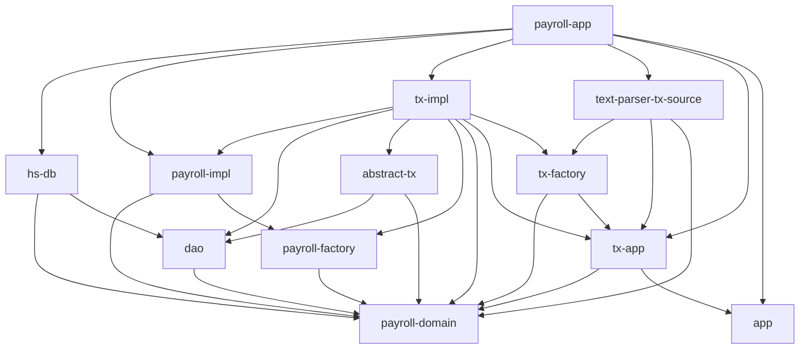

# payroll (ケーススタディ)

ref.) [アジャイルソフトウェア開発の奥義 第2版](https://www.amazon.co.jp/dp/4797347783)

## Usage

```bash
$ cargo run -- -h

Usage: target/debug/payroll-app [options] FILE

Options:
    -h, --help          Print this help menu
    -q, --quiet         Don't output unnecessary information
    -c, --chronograph   Print the time taken to execute each transaction
    -r, --repl          Run into REPL mode
```

## Architecture (Dependent Relationship of crates)



