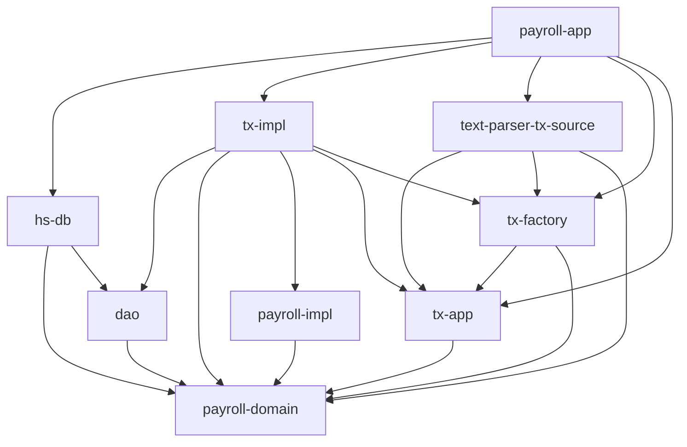

# payroll

```mermaid
graph TD

  payroll-impl --> payroll-domain

  dao --> payroll-domain
  
  tx-impl --> dao
  tx-impl --> payroll-domain
  tx-impl --> payroll-impl
  tx-impl --> tx-app
  tx-impl --> tx-factory
  
  tx-app --> payroll-domain

  tx-factory --> tx-app
  tx-factory --> payroll-domain
  
  text-parser-tx-source --> tx-app
  text-parser-tx-source --> tx-factory
  text-parser-tx-source --> payroll-domain
  
  hs-db --> payroll-domain
  hs-db --> dao
  
  payroll-app --> hs-db
  payroll-app --> tx-impl
  payroll-app --> text-parser-tx-source
  payroll-app --> tx-factory
  payroll-app --> tx-app
```
