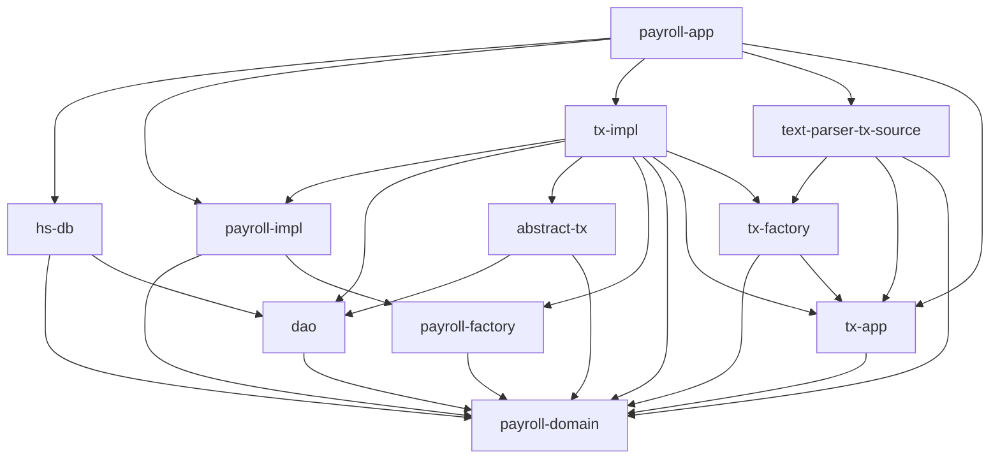

# payroll (ケーススタディ)

ref.) [アジャイルソフトウェア開発の奥義 第2版](https://www.amazon.co.jp/dp/4797347783)

```mermaid
graph TD

  payroll-impl --> payroll-domain
  payroll-impl --> payroll-factory

  payroll-factory --> payroll-domain

  dao --> payroll-domain

  abstract-tx --> dao
  abstract-tx --> payroll-domain

  tx-impl --> payroll-impl
  tx-impl --> dao
  tx-impl --> abstract-tx
  tx-impl --> payroll-factory
  tx-impl --> payroll-domain
  tx-impl --> tx-app
  tx-impl --> tx-factory

  tx-app --> payroll-domain

  tx-factory --> payroll-domain
  tx-factory --> tx-app

  text-parser-tx-source --> tx-factory
  text-parser-tx-source --> tx-app
  text-parser-tx-source --> payroll-domain

  hs-db --> payroll-domain
  hs-db --> dao

  payroll-app --> hs-db
  payroll-app --> payroll-impl
  payroll-app --> tx-impl
  payroll-app --> text-parser-tx-source
  payroll-app --> tx-app
```
