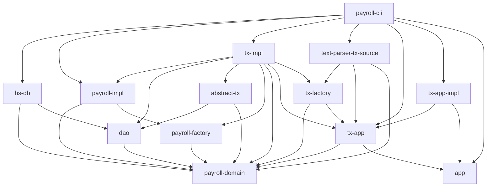

# payroll (Case Study of Uncle Bob)

[](https://github.com/cutsea110/payroll/actions/workflows/rust.yml)
[](https://hub.docker.com/repository/docker/cutsea110/payroll-app/general)

ref.) [アジャイルソフトウェア開発の奥義 第2版](https://www.amazon.co.jp/dp/4797347783)

This project is implementation for payroll application written in Rust.
The payroll app is described at the book above.

## Usage

```bash
$ cargo run -p payroll-app -- -h

Usage: target/debug/payroll-app [options] FILE

Options:
    -h, --help          Print this help menu
    -q, --quiet         Don't output unnecessary information
    -f, --failopen-tx   Transaction failopen
    -s, --soft-landing  Soft landing application
    -c, --chronograph   Print the time taken to execute each transaction
    -r, --repl          Run into REPL mode
```

## Architecture (Dependent Relationship of crates)



## Run on docker

See [Dockerhub cutsea110/payroll-app](https://hub.docker.com/repository/docker/cutsea110/payroll-app/general).

```bash
$ docker run -v ./:/work -it --rm cutsea110/payroll-app:0.1.3 payroll-app -h
Usage: payroll-app [options] FILE

Options:
    -h, --help          Print this help menu
    -q, --quiet         Don't output unnecessary information
    -f, --failopen-tx   Transaction failopen
    -s, --soft-landing  Soft landing application
    -c, --chronograph   Print the time taken to execute each transaction
    -r, --repl          Run into REPL mode
```

## For Developer

### Unit test

Do unit test as below.

```bash
$ cargo test
```

### Scenario test

If you do scenario tests which are in ./scenario directory, you do as below.
You should see [here](payroll-test/README.md) in detail.

```bash
$ cargo run -p payroll-test -- ./scenario/test*.scr
```

### How to build Docker image

You should specify the version 0.1.4, because the latest version is 0.1.3.1.

```bash
$ docker buildx build --load -t cutsea110/payroll-app:0.1.4 .
```
### How to run on Docker image

I suppose that you have some test programs for payroll-app in `${PWD}/scenario` directory.

```bash
$ docker run -v ${PWD}/scenario:/work -it --rm cutsea110/payroll-app:0.1.4 payroll-app /work/test1.scr
```

### Share Dockerhub

```bash
$ docker login
$ docker push cutsea110/payroll-app:0.1.4
```

### Update This README

You should update docker image version for next.
