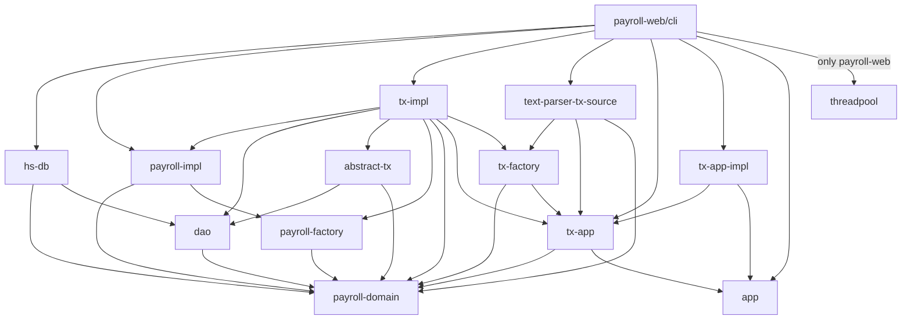

# payroll (Case Study of Uncle Bob)

[](https://github.com/cutsea110/payroll/actions/workflows/rust.yml)
[](https://hub.docker.com/repository/docker/cutsea110/payroll-cli/general)
[](https://hub.docker.com/repository/docker/cutsea110/payroll-web/general)

ref.) [アジャイルソフトウェア開発の奥義 第2版](https://www.amazon.co.jp/dp/4797347783)

This project is implementation for payroll application written in Rust.
The payroll app is described at the book above.

## Usage

* CLI (Command Line Interface)

```bash
$ cargo run -p payroll-cli -- -?
Usage: target/debug/payroll-cli [options] FILE

Options:
    -?, --help          Print this help menu
    -q, --quiet         Don't output unnecessary information
    -f, --failopen-tx   Transaction failopen
    -s, --soft-landing  Soft landing application
    -c, --chronograph   Print the time taken to execute each transaction
    -r, --repl          Run into REPL mode
```

* Web server

```bash
$ cargo run -p payroll-web -- -?
Usage: target/debug/payroll-web [options]

Options:
    -?, --help          Print this help menu
    -h, --host HOST     hostname or Ip address to connect to
    -q, --quiet         run in quiet mode, non verbose
    -p, --port PORT     port to connect to
    -t, --threads THREADS
                        number of threadpool size
    -c, --chronograph   enable chronograph mode
```

## Architecture (Dependent Relationship of crates)



### Description of top directories

- commands
  - `/payroll-cli`: application as command line interface
  - `/payroll-web`:  application as web server
  - `/payroll-test`: scenario test runner, this depends on `payroll-cli` executable binary

- libraries
  - `/abstract-tx`: abstract transaction
  - `/app`: interface of application
  - `/dao`: interface of data access object layer
  - `/hs-db`: hash database which store data into only memory
  - `/payroll-domain`: domain objects and interfaces
  - `/payroll-factory`: a factory of payroll
  - `/payroll-impl`: an implementation of payroll domain
  - `/text-parser-tx-source`: text parser for transaction
  - `/threadpool`: a simple thread pool library for web server
  - `/tx-app`: interface of transaction application
  - `/tx-app-impl`: an implementation of transaction application
  - `/tx-factory`: a factory of transaction implementation
  - `/tx-impl`: an implementation of transaction

- others
  - `/scenario`: test scenarios which are used by `payroll-test`
  - `/dockerfiles`: Docker files of `payroll-cli` and `payroll-web`

## Run on docker

### payroll-cli

See [Dockerhub cutsea110/payroll-cli](https://hub.docker.com/repository/docker/cutsea110/payroll-cli).

```bash
$ docker run -v ./:/work -it --rm cutsea110/payroll-cli:0.2.1 payroll-cli -?
Usage: payroll-cli [options] FILE

Options:
    -?, --help          Print this help menu
    -q, --quiet         Don't output unnecessary information
    -f, --failopen-tx   Transaction failopen
    -s, --soft-landing  Soft landing application
    -c, --chronograph   Print the time taken to execute each transaction
    -r, --repl          Run into REPL mode
```

### payroll-web

See [Dockerhub cutsea110/payroll-web](https://hub.docker.com/repository/docker/cutsea110/payroll-web).

```
$ docker run -it --rm cutsea110/payroll-web:0.1.2 payroll-web -?
Usage: target/debug/payroll-web [options]

Options:
    -?, --help          Print this help menu
    -h, --host HOST     hostname or Ip address to connect to
    -q, --quiet         run in quiet mode, non verbose
    -p, --port PORT     port to connect to
    -t, --threads THREADS
                        number of threadpool size
    -c, --chronograph   enable chronograph mode
```

## For Developer

### Unit test

Do unit test as below.

```bash
$ cargo test
```

### Scenario test

If you do scenario tests which are in ./scenario directory, you do as below.
You should see [here](payroll-test/README.md) in detail.

```bash
$ cargo run -p payroll-test -- ./scenario/test*.scr
```

### How to build Docker image (payroll-cli)

You should specify the version 0.2.2, because the latest version is 0.2.1.

```bash
$ docker buildx build --load -t cutsea110/payroll-cli:0.2.2 -f ./dockerfiles/Dockerfile.cli .
```
### How to run on Docker image (payroll-cli)

I suppose that you have some test programs for payroll-cli in `${PWD}/scenario` directory.

```bash
$ docker run -v ${PWD}/scenario:/work \
             -it --rm cutsea110/payroll-cli:0.2.2 \
             payroll-cli /work/test1.scr
```

### Share Dockerhub (payroll-cli)

```bash
$ docker login
$ docker push cutsea110/payroll-cli:0.2.2
```

### How to build Docker image (payroll-web)

You should specify the version 0.1.3, because the latest version is 0.1.2.

```bash
$ docker buildx build --load -t cutsea110/payroll-web:0.1.3 -f ./dockerfiles/Dockerfile.web .
```
### How to run on Docker image (payroll-web)

I suppose that you have some test for payroll-web for manually.

```bash
$ docker run -e RUST_LOG=trace -p 3000:3000 -it --rm cutsea110/payroll-web:0.1.3
```

Then, you should open an another terminal and do curl like below:

```bash
curl -X POST \
     -H 'Content-Type: text/plain' \
     -d $'AddEmp 1429 "Bob" "Wall St." S 3988.92\nPayday 2025-02-28' \
     http://localhost:3000
```

If you start payroll-web as below:

```bash
$ docker run -e RUST_LOG=trace -p 7878:3000 -it --rm cutsea110/payroll-web:0.1.3
```

Then, you can request to the port 7878.

```bash
curl -X POST \
     -H 'Content-Type: text/plain' \
     -d $'AddEmp 1429 "Bob" "Wall St." S 3988.92\nPayday 2025-02-28' \
     http://localhost:7878
```

Or, you let payroll-web bind to the port 7878 in docker and the docker can handle requests on the port 3000.

```bash
$ docker run -e RUST_LOG=trace \
             -p 3000:7878 \
             -it --rm cutsea110/payroll-web:0.1.3 \
             payroll-web -h 0.0.0.0 -p 7878
```

Note that you need to direct the host as 0.0.0.0, too.


### Share Dockerhub (payroll-web)

```bash
$ docker login
$ docker push cutsea110/payroll-web:0.1.3
```

### Update This README

You should update docker image version for next.
