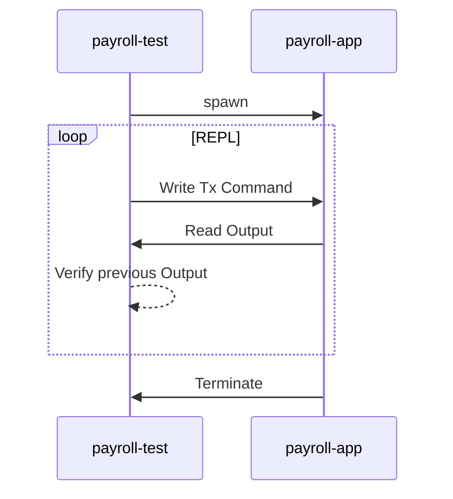

# Scenario Test for Payroll

## Architecture



## Extra commands to verify

You can use extra commands below in transaction script.
payroll-test's test runner can handle these comamnds, and check the previous output from payroll-app.

- `<emp_id>` is unsigned integer as employee id.
- `<amount>` is floating number as expected amount of `gross_pay` or `deductions` or `net_pay`.

```
Verify Paycheck EmpId <emp_id> GrossPay   <amount>
Verify Paycheck EmpId <emp_id> Deductions <amount>
Verify Paycheck EmpId <emp_id> NetPay     <amount>
```
