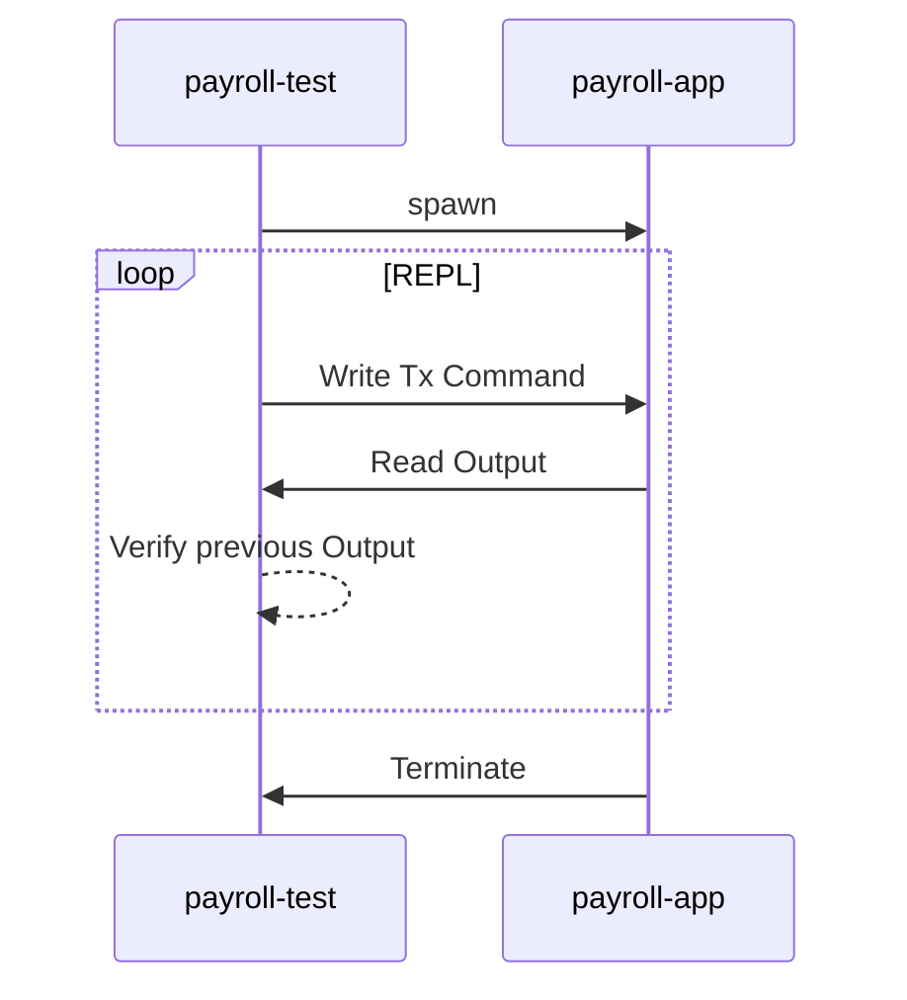

# Scenario Test for Payroll

## Architecture

```mermaid
sequenceDiagram
    participant PayrollTest as payroll-test
    participant PayrollApp as payroll-app

    PayrollTest->>PayrollApp: spawn
    loop REPL
        PayrollTest->>PayrollApp: Write Tx Command
        PayrollApp->>PayrollTest: Read Output
        PayrollTest-->>PayrollTest: Verify previous Output
    end
    PayrollApp->>PayrollTest: Terminate
```
