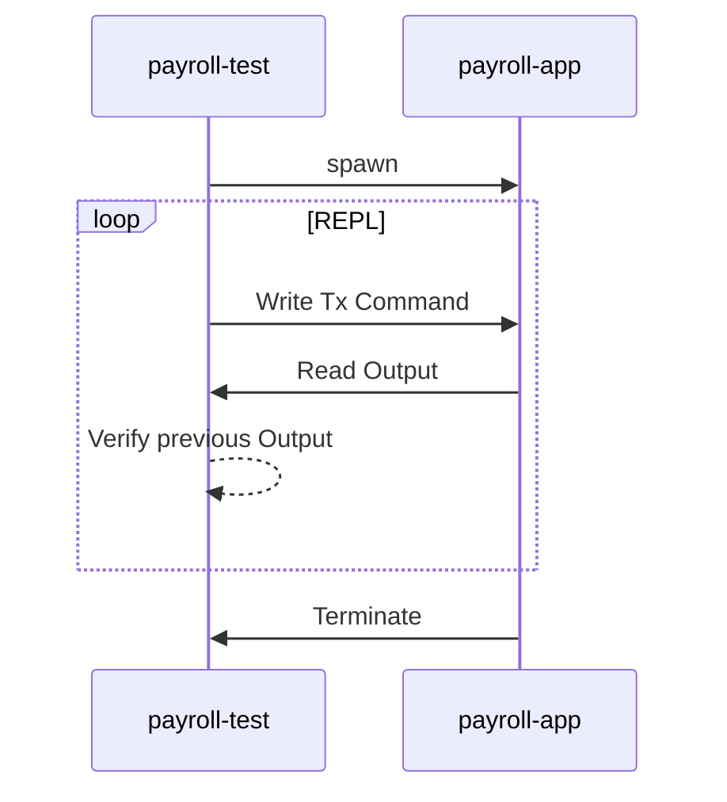

# Scenario Test for Payroll

# How to use

You shuold prepare for test scenario script, and run for it like as below.

```bash
$ cargo run -p payroll-test -- ./scenario/test1.scr
```

# Prerequisite

The payroll-test require the program payroll-app at `target/debug` directory.
As you must build the program payroll-app before using payroll-test.

```bash
$ cargo build --bin payroll-app
```

If you direct an another payroll-app version, you should set the program's path to `TARGET_PATH` environment variable.


## Architecture



## Extra commands to verify

You can use extra commands below in transaction script.
payroll-test's test runner can handle these comamnds, and check the previous output from payroll-app.

Note below:

1. The test runner can hold Paycheck data as temporarily.
2. When the test runner read `Paycheck` command, the runner write it to payroll-app then collect Paycheck data from payroll-app's output.
3. When the test runner read `Verify` command, the runner verify the collected Paycheck data.
4. When the test runner read the other commands or comments, the runner write it to payroll-app then clean up previously collected Paycheck data.

- `<emp_id>` is unsigned integer as employee id.
- `<amount>` is floating number as expected amount of `gross_pay` or `deductions` or `net_pay`.

```
Verify Paycheck EmpId <emp_id> GrossPay   <amount>
Verify Paycheck EmpId <emp_id> Deductions <amount>
Verify Paycheck EmpId <emp_id> NetPay     <amount>
```
